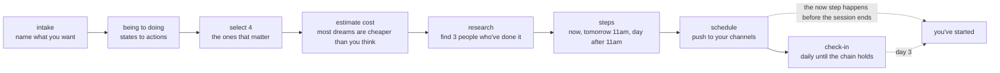

# nudge

Most people know what they want. They just haven't taken the first step.

Nudge is a small set of prompts and templates you install into the AI assistant you already run daily. Claude Code, Codex, Cursor, Hermes, whatever you use as your life OS, not just your coding tool. Your agent runs you through a short exercise that turns the things you keep saying you want into actions you take this week.

Not next month. Not Monday. Today, before you close the chat.

## Who this is for

You already talk to your agent every day. You use it to draft emails, plan your week, think through decisions, manage your life. Your agent isn't just a coding tool. It's the operating system for how you get things done.

Nudge fits into that. It's not a coding skill. There's no code to write, no repo to build, no deploy. It's a life exercise that your agent runs you through, the same way it runs you through a weekly review or a decision matrix.

If your agent is just a code completion tool to you, this isn't for you. If your agent is a daily thinking partner, this is for you.

## How it works



The whole exercise runs in about 20 minutes. The first action happens before you close the chat. The next two happen before 11am the next two mornings. The check-in holds the chain for three days. By day three, you've moved.

## Get started

You don't need to install anything. Just give your agent the repo and ask it to run you through it.

### The quick start (works in any agent)

Paste this into Claude Code, Codex, Cursor, Hermes, or whatever you use:

```
Read https://github.com/a692570/nudge and run me through the protocol in protocol.md.
Use the prompts in the prompts/ folder for each stage.
Follow the guardrails in guardrails.md: assist me, don't replace me.
Start with Stage 1.
```

That's it. Your agent will pull the protocol, read the guardrails, and start the exercise with you. You answer the questions, it takes you through each stage, and by the end you'll have a dreamline file saved locally and a first step taken today.

### The install (for agents with a skills folder)

If your agent has a skills system (Hermes, some Claude Code setups), you can install nudge permanently:

1. Clone or download this repo.
2. Drop the `nudge/` directory into your agent's skills folder.
3. Tell your agent: "run nudge" or "start a dreamline."

The agent loads the protocol on demand and runs you through it whenever you ask.

### What you'll have at the end

- A markdown file (`dreamline-[date].md`) with your four dreams, the research, and the three steps for each
- One action already taken today
- Two reminders scheduled for tomorrow and the day after, before 11am
- A daily check-in set for 10:30am until you tell it to stop

## The problem it solves

You have a list of things you want. Learn a language. Live in another country. Write a book. Start a project. The list sits there. You'll get to it. You never get to it.

The gap between wanting and doing is not a motivation problem. It's a structure problem. Most goals are too vague to act on, too far away to start, and too unscheduled to survive the first busy week.

Nudge fixes the structure. It runs you through a short exercise that:

1. **Forces you to name what you actually want**, not what sounds good to say out loud. The embarrassing version. The Ferrari. The move to Tokyo. The thing you'd be shy to tell your parents.
2. **Converts states into actions.** "Be a great cook" is a state with no endpoint. "Cook Christmas dinner for 8 people without help" is an action you can take.
3. **Finds three people who've done each thing** and shows you the concrete steps they took. You're not guessing at the path. You're following a path that worked.
4. **Generates three steps you take now, tomorrow before 11am, and the day after before 11am.** Specific, grounded in the research, doable without anyone's permission.
5. **Checks in with you each morning** until the chain holds. Three days. Three steps. By day three, you've moved.

## Where it comes from

The exercise was originally designed by Tim Ferriss in *The 4-Hour Workweek*. He called it "dreamlining." The name never stuck. It sounds like a vacation brochure. The exercise itself is sharper than the name suggests: a structured way to stop deferring the things you say you want.

Nudge takes that exercise and packages it for the tool you already use. You don't have to read the book. Your agent runs you through it.

## What it is not

Nudge does not name your dreams for you. It does not write your steps without your input. It does not take the actions in your place. The whole point is the part where you face what you want and commit to a first step. If the agent did that work, the exercise would be worthless. Nudge is a coach that refuses to do the reps for you.

## What's inside

- `protocol.md` — the full exercise, stage by stage
- `guardrails.md` — where the agent stops (the assist-don't-replace boundary)
- `prompts/` — the prompts for each stage (intake, being-to-doing, research, steps, schedule, daily check-in)
- `templates/` — the blank file the agent fills with you
- `examples/` — one worked example so you can see what the output looks like

## License

MIT
